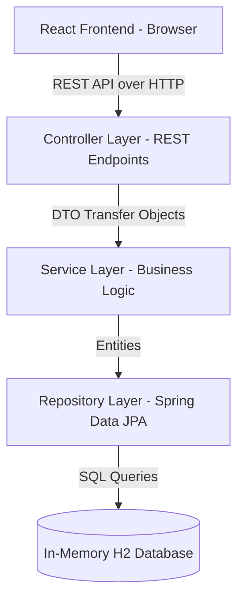

# Project Overview: Personal Finance Tracker

This document provides a comprehensive technical overview of the Personal Finance Tracker application. It outlines the system architecture, frontend and backend details, database integration, packaging strategy, and key interview questions to help you explain the project confidently in an interview.

---

## 1. Executive Summary & Tech Stack

The **Personal Finance Tracker** is a full-stack, single-user web application designed to help users manage their income, expenses, monthly budgets, and savings goals. It features real-time financial dashboards, interactive data visualizations (charts), transaction management, and exportable financial reports (PDF & CSV).

### Tech Stack
- **Frontend**: React (v18), Vite, Vanilla CSS (custom styled for premium glassmorphic/dark aesthetics), Recharts (data visualizations), Lucide-React (icons), Axios (API client).
- **Backend**: Spring Boot (v3.3), Spring Data JPA, Java 17, Maven.
- **Database**: In-memory H2 Database (for zero-setup, lightweight execution).
- **Reporting**: OpenPDF (for PDF compilation) & custom CSV serializer.
- **Packaging/Routing**: Monolithic packaging (React built and hosted directly from the Spring Boot JAR on a single port `8081`).

---

## 2. Architecture & Design Patterns

The application follows a standard **Client-Server Architecture** utilizing a **Layered (n-Tier) Architecture** in the backend and a **Component-Based Architecture** in the frontend.



### Key Design Patterns Used:
1. **Model-View-Controller (MVC) Pattern (Restful)**:
   - **Model**: JPA Entities (`Income`, `Expense`, `Budget`, `SavingsGoal`, `User`).
   - **View**: React Components rendering the dynamic UI.
   - **Controller**: REST Controllers exposing endpoints under `/api`.
2. **Repository Pattern**: Abstracting database access through Spring Data JPA interfaces.
3. **Data Transfer Object (DTO) Pattern**: Standardizing request and response models (`TransactionRequest`, `BudgetResponse`, etc.) to decouple database entity structure from the client interface.
4. **Service Layer Pattern**: Isolating core calculations, reporting logic, and transactional boundaries away from controllers.

---

## 3. Backend Implementation Details

The backend is built as a lightweight REST API.

### Layered Structure:
- **JPA Entities**: Represent tables in the H2 database.
  - [User](file:///d:/My%20Projects/ILP/fs/finance-tracker/backend/src/main/java/com/finance/tracker/entity/User.java): Default single guest user created at ID `1`.
  - [Expense](file:///d:/My%20Projects/ILP/fs/finance-tracker/backend/src/main/java/com/finance/tracker/entity/Expense.java) & [Income](file:///d:/My%20Projects/ILP/fs/finance-tracker/backend/src/main/java/com/finance/tracker/entity/Income.java): Hold transaction records.
  - [Budget](file:///d:/My%20Projects/ILP/fs/finance-tracker/backend/src/main/java/com/finance/tracker/entity/Budget.java): Handles category-based limits per month.
  - [SavingsGoal](file:///d:/My%20Projects/ILP/fs/finance-tracker/backend/src/main/java/com/finance/tracker/entity/SavingsGoal.java): Tracks current vs target savings.
- **REST Controllers**: Intercept requests, validate inputs via `jakarta.validation.Valid`, and delegate to service classes. Examples:
  - [TransactionController](file:///d:/My%20Projects/ILP/fs/finance-tracker/backend/src/main/java/com/finance/tracker/controller/TransactionController.java): Exposes endpoints to add, retrieve, update, and delete transactions.
  - [ReportController](file:///d:/My%20Projects/ILP/fs/finance-tracker/backend/src/main/java/com/finance/tracker/controller/ReportController.java): Stream reports.
- **Services**: Implement the business algorithms.
  - [ReportServiceImpl](file:///d:/My%20Projects/ILP/fs/finance-tracker/backend/src/main/java/com/finance/tracker/service/ReportServiceImpl.java): Uses **OpenPDF** to write tables and summary cards in PDF, and standard UTF-8 string serialization for CSV generation.
- **Database (H2)**: Configured in `application.properties` as an in-memory database (`jdbc:h2:mem:financetracker`). This eliminates the need for MySQL server startup, allowing the app to run instantly on any machine.

---

## 4. Frontend Implementation Details

The frontend is a single-page application (SPA) created using React and compiled via Vite.

### Key Aspects:
- **Global Context (`AuthContext`)**: Since this is running in simplified single-user mode, a default guest user `{ name: 'Guest User', username: 'Guest User', email: 'guest@example.com' }` is injected immediately on app load, bypassing the login/signup screens.
- **Axios Instance**: Configured in [api.js](file:///d:/My%20Projects/ILP/fs/finance-tracker/frontend/src/services/api.js) with a base URL of `/api` to consolidate network calls.
- **Interactive UI Components**:
  - **Dashboard**: Displays income vs expense overview using bar charts, expense category distribution using pie charts, and monthly savings trends using line charts via **Recharts**.
  - **Budgets**: Implements logic showing active category limits and progress bars with warning colors when thresholds are exceeded.
  - **Transactions**: Consolidated form that allows creating/deleting Income and Expense logs dynamically.

---

## 5. Single-Port Packaging & Routing Flow (The "Secret Sauce")

A major feature of this project is its **Single-Port Monolithic Packaging**. Instead of running separate dev servers for React (`5173`) and Spring Boot (`8081`) in production, both run together.

### How it works:
1. **Frontend Build Pipeline**:
   Vite is configured in [vite.config.js](file:///d:/My%20Projects/ILP/fs/finance-tracker/frontend/vite.config.js) to compile HTML, CSS, and JS and output them directly to the backend's resources directory:
   ```javascript
   build: {
     outDir: '../backend/src/main/resources/static',
     emptyOutDir: true
   }
   ```
2. **Spring Boot Static Resource Handler**:
   Spring Boot automatically serves files inside the `src/main/resources/static` directory. So navigating to `http://localhost:8081/` automatically returns React's `index.html`.
3. **Single Page Application Routing (SPA Forwarding)**:
   In an SPA, navigation happens via client-side routing (e.g. going to `/dashboard` or `/transactions`). If a user refreshes the page on `/dashboard`, Spring Boot would throw a `404` because it doesn't have a controller mapped to `/dashboard`.
   To solve this, we implemented [SPAForwardController.java](file:///d:/My%20Projects/ILP/fs/finance-tracker/backend/src/main/java/com/finance/tracker/controller/SPAForwardController.java):
   ```java
   @Controller
   public class SPAForwardController {
       @RequestMapping(value = "/{path:[^\\.]*}")
       public String redirect() {
           // Forwards all non-file paths (paths without a dot) to React's index.html
           return "forward:/index.html";
       }
   }
   ```
   This forwards any non-file request back to `/index.html`, allowing the frontend React Router to parse the path and load the correct view without throwing a 404.

---

## 6. Key Interview Questions & Answers

Use these answers during your interview to showcase your depth of understanding:

### Q1: Can you explain the data flow when a user adds a new Expense?
> **Answer**: 
> 1. The user fills out the transaction form in the frontend component (`Transactions.jsx`) and submits it.
> 2. The frontend makes a `POST` request to `/api/expenses` with the payload (amount, category, description, date) using Axios.
> 3. In the backend, the request lands in `ExpenseController.createExpense()`. It validates the fields using `@Valid`.
> 4. The controller fetches the default guest User (ID 1) from the database and passes it along with the entity to the `ExpenseService`.
> 5. The service calculates calculations or updates budget constraints, then calls `ExpenseRepository.save(expense)`.
> 6. Spring Data JPA persists the row into the H2 Database.
> 7. The controller returns the created Expense object as a JSON response with status `200 OK`.
> 8. The frontend receives the response, updates the React state array, and Recharts automatically triggers a smooth re-render of the dashboard graphs to reflect the new expense.

### Q2: Why did you choose H2 database instead of MySQL?
> **Answer**: 
> "For this project, I used H2 as an in-memory database to enable **zero-setup execution**. MySQL requires manual installation, database/user creation, and starts on a specific port which often conflicts with local database listeners (such as Oracle Listener running on port 8080/8081). By using H2, the application runs entirely self-contained in the JVM. It automatically spins up, builds the schema on launch using Hibernate DDL-Auto (`update`), and shuts down cleanly with the server. This makes the project highly portable, clean, and error-free when launching it in different environments."

### Q3: How do you serve a React App and a Java API from a single port?
> **Answer**: 
> "I configured Vite to build the React application directly into Spring Boot’s `src/main/resources/static` folder. When the Spring Boot JAR is launched, Tomcat serves these static assets on port `8081` at the root URL.
> To prevent client-side routing from causing 404 errors during a page refresh, I implemented an `SPAForwardController` in Spring Boot. It uses a regular expression matching pattern to forward all non-static-file paths (paths without file extensions) to `/index.html`. This hands routing back to React, enabling smooth client-side routing on a single port."

### Q4: How is the PDF report generated in the backend?
> **Answer**: 
> "I integrated the **OpenPDF** library in the backend pom.xml. In `ReportServiceImpl`, when a user requests a report, we fetch their income and expenses for the specified date range. We compile the data, calculate totals and net savings, and write them into a PDF document model using layout components like `Paragraph`, `PdfPTable` (for transaction log grids), and colored `PdfPCell` blocks (representing cards). We stream this document into a `ByteArrayOutputStream` and return the raw byte array with content-type `application/pdf` so the browser can download or render it directly."
